# Kosmo-Arm | Манипулятор КОСМО

Открытый проект учебного  манипулятора на стандартных сервоприводах, разработанный для участников чемпионата **«Кубок роверов»** (https://roverchallenge.ru/). Детали спроектированы для печати на 3D-принтере. Так же доступна а STEP-модель  - ее можно использовать для  для изучения конструкции и собственных доработок.

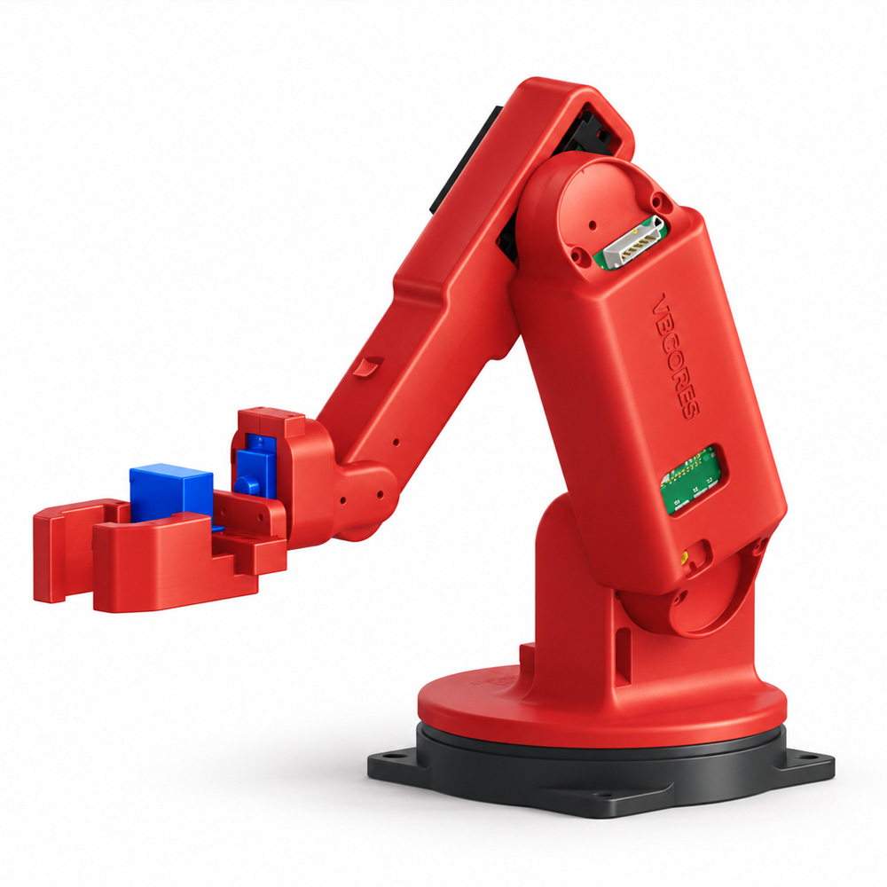

## Содержимое репозитория

| Папка | Содержимое |
| --- | --- |
| [stl](stl/) | Модели деталей для 3D-печати |
| [step](step/) | [Сборка в формате STEP](step/Assembly_KOSMO_Arm.stp) для просмотра и редактирования в CAD |
| [media](media/) | Папка для изображений |

## Как скачать и распечатать STL

1. На странице репозитория нажмите **Code → Download ZIP**.
2. Распакуйте архив и откройте папку `stl`.
3. Импортируйте нужные файлы `.stl` в слайсер.
4. Модели сохранены в единицах **мм**
5. Распечатайте продную модель, например 5 звено (j5).
6. Проверьте что сервопривод удобно устанавливается в паз. 
7. При необходимости подберите коэфициент масштабирования - он может зависит от вашего материала и принтера.

Чтобы скачать одну модель, откройте её файл в папке [stl](stl/) на GitHub и нажмите **Download raw file** (значок скачивания).

### Файлы для печати

Нажмите на превью, чтобы открыть изображение крупнее. Детали показаны в индивидуальном масштабе; ракурс превью не является рекомендацией по ориентации при печати.

| Превью | Файл | Описание | Количество |
| --- | --- | --- | ---: |
| [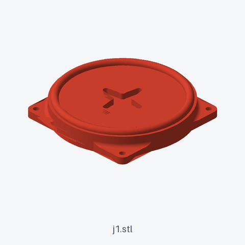](media/stl-previews/j1.png) | [j1.stl](stl/j1.stl) | Основание манипулятора | 1 шт. |
| [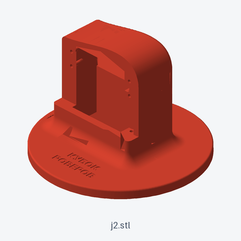](media/stl-previews/j2.png) | [j2.stl](stl/j2.stl) | Второе звено | 1 шт. |
| [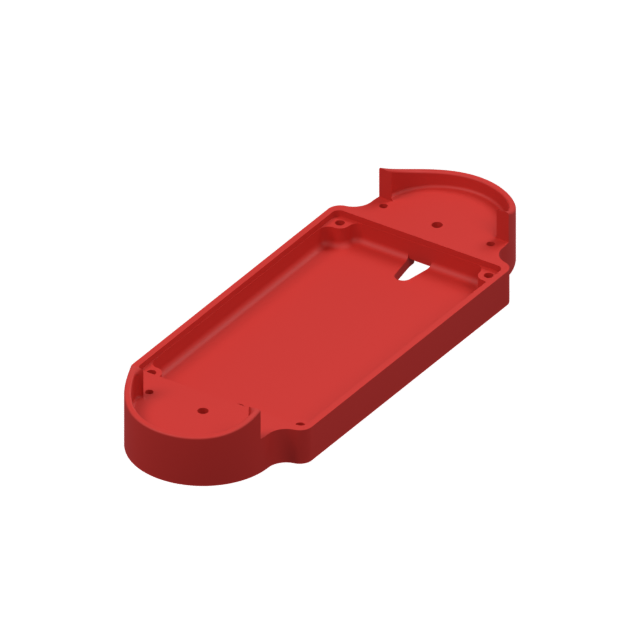](media/stl-previews/j3-el-base.png) | [j3-el-base.stl](stl/j3-el-base.stl) | Основа третьего звена для установки платы VBcores Servo board | 1 шт. |
| [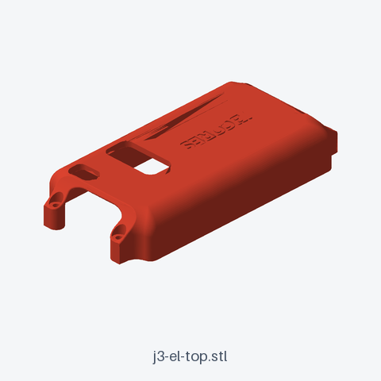](media/stl-previews/j3-el-top.png) | [j3-el-top.stl](stl/j3-el-top.stl) | Крышка третьего звена для варианта с платой VBcores Servo board | 1 шт. |
| [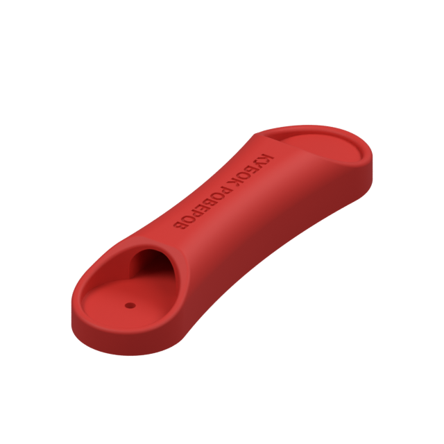](media/stl-previews/j3-alternative.png) | [j3-alternative.stl](stl/j3-alternative.stl) | Альтернативное третье звено при размещении электроники снаружи манипулятора | 1 шт. |
| [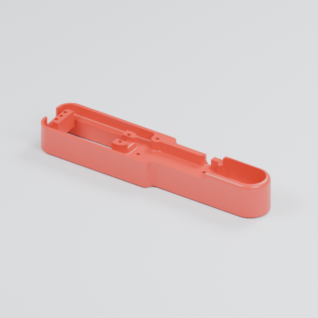](media/stl-previews/j4-b.png) | [j4-b.stl](stl/j4-b.stl) | Основа четвёртого звена | 1 шт. |
| [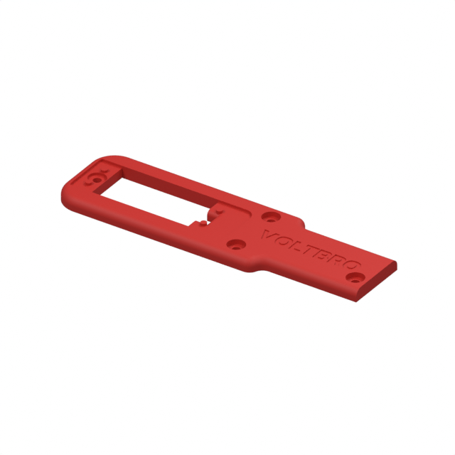](media/stl-previews/j4-t.png) | [j4-t.stl](stl/j4-t.stl) | Крышка четвёртого звена | 1 шт. |
| [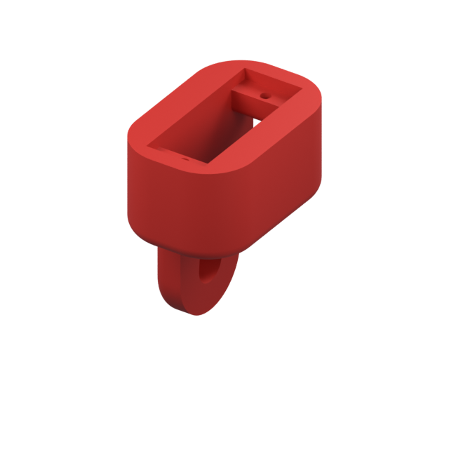](media/stl-previews/j5.png) | [j5.stl](stl/j5.stl) | Пятое звено с двумя отверстиями для крепления держателя камеры. При необходимости держатель проектируется самостоятельно | 1 шт. |
| [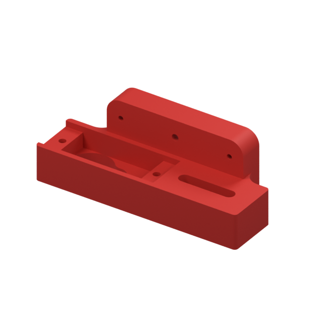](media/stl-previews/gripper-base.png) | [gripper-base.stl](stl/gripper-base.stl) | Основа захвата | 1 шт. |
| [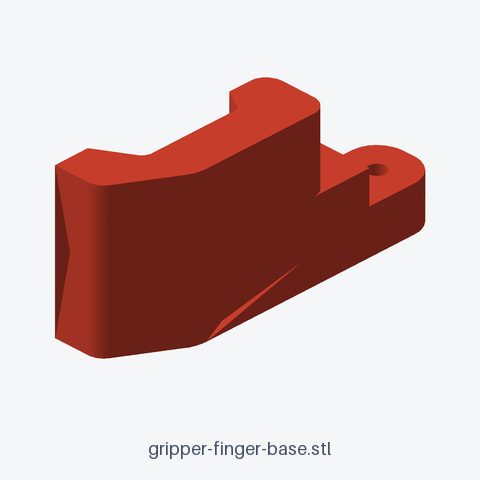](media/stl-previews/gripper-finger-base.png) | [gripper-finger-base.stl](stl/gripper-finger-base.stl) | Неподвижный захват манипулятора | 1 шт. |
| [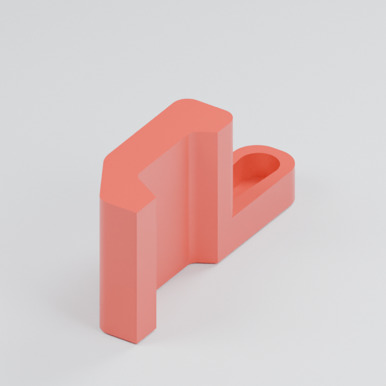](media/stl-previews/gripper-finger.png) | [gripper-finger.stl](stl/gripper-finger.stl) | Подвижный захват манипулятора | 1 шт. |

Примечание - при сборке используются насадки на сервопривод которые идут в комплекте.  В зависимости от производителя они могут не попадать в пазы, в этом случае их необходимо будет "доработать напильником".  

Все крепления спроектированы таким образом что насадка на серво вставляется в паз и притягивается центральным винтом. дополнительные крепления насадок не требуются.

### Перед печатью полного комплекта

1. **Проверьте размеры.** STL не хранит единицы измерения. Сверьте посадочные размеры с CAD и реальными сервоприводами; не используйте автоматическое вписывание модели в стол.
2. **Выберите ориентацию каждой детали.** Учитывайте устойчивость на столе, посадочные поверхности и направление нагрузки. Избегайте положения, в котором нагруженные крепления легко отрываются вдоль слоёв.
3. **Проверьте поддержки.** Просмотрите нависания в слайсере. По возможности не размещайте поддержки на точных посадочных поверхностях.
4. **Сначала проверьте посадку.** Напечатайте одну деталь с креплением сервопривода и проверьте установку корпуса, крепежа и качалки без чрезмерного усилия.
5. **Настройте компенсацию усадки.** Важно подобрать масштаб печати под свой принтер, пластик и профиль. Универсального значения для всех принтеров и материалов нет. 
6. **Обработайте детали.** Удалите поддержки и заусенцы, проверьте отверстия и свободный ход соединений. После проверки посадок печатайте остальные детали.

## Сборка и первый запуск

Используйте [STEP-сборку](step/Assembly_KOSMO_Arm.stp) и фотографии как ориентир по расположению узлов. 

- До установки качалок задайте сервоприводам исходное центральное положение позволяющее конструкции вращатся в нужном диапазоне. Рекомендуем использовать для тестирование устройства для проверки серво.
- Закрепите основание и проверьте, что провода не натягиваются и не попадают в шарниры во всём рабочем диапазоне.
-

## Фотографии прототипа

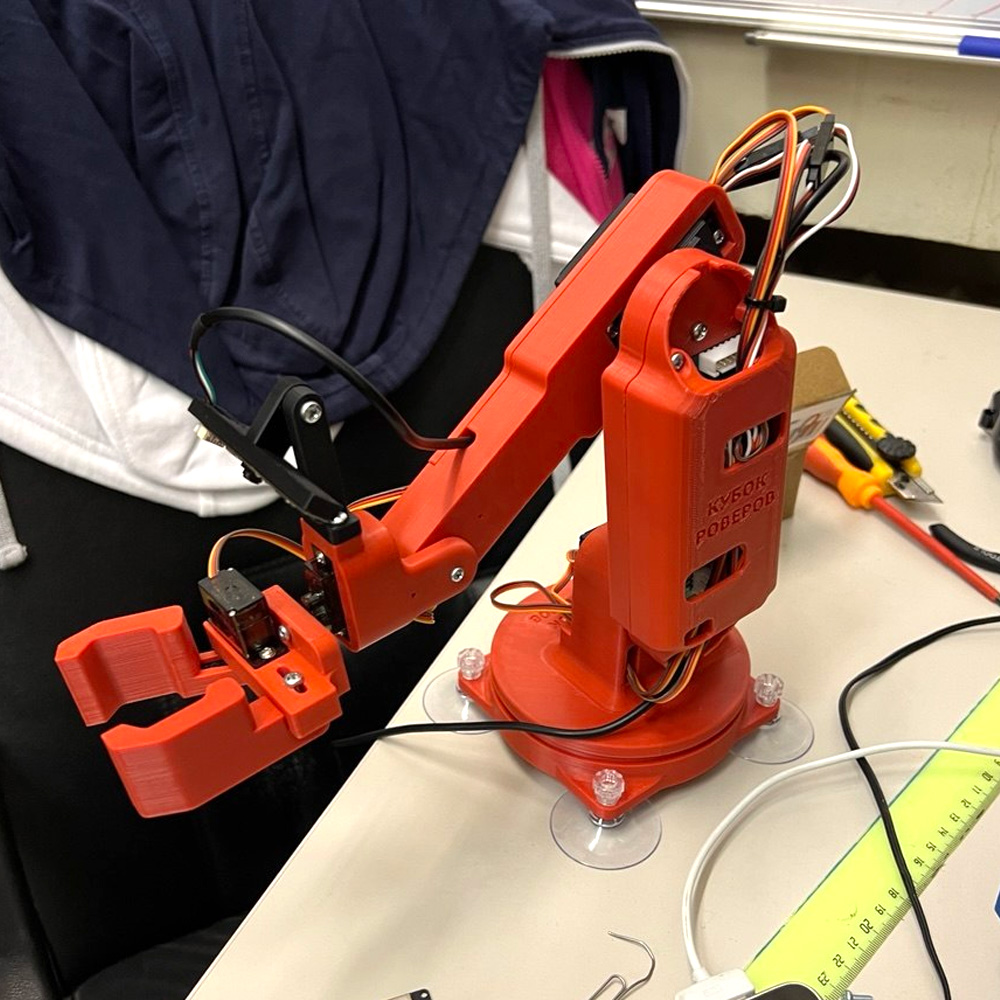

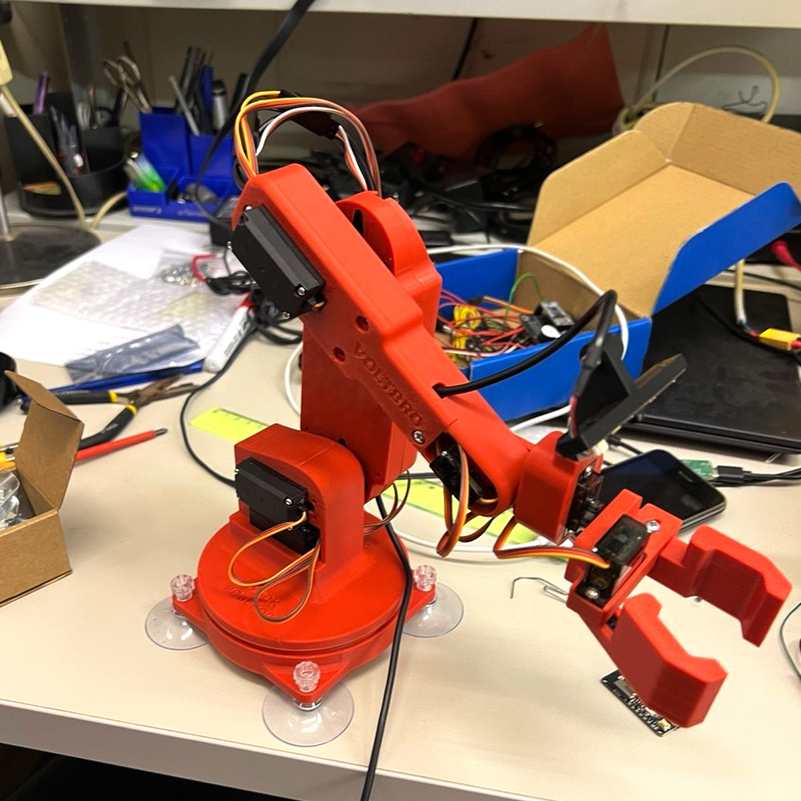

