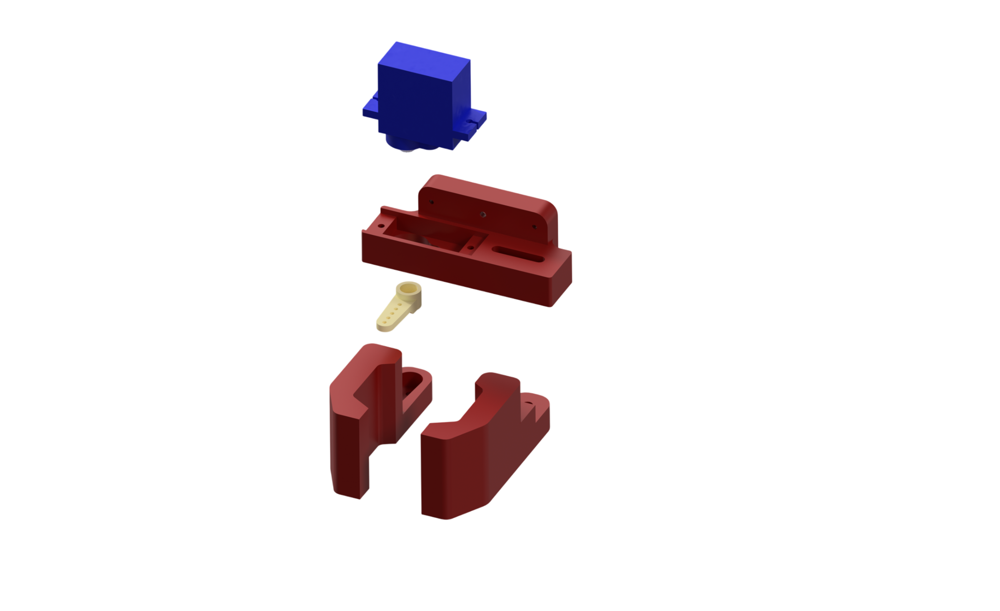

# Сборка манипулятора КОСМО

Используйте [STEP-сборку](../step/Assembly_KOSMO_Arm.stp) и фотографии как ориентир по расположению узлов. 

- До установки качалок задайте сервоприводам исходное центральное положение, позволяющее конструкции вращаться в нужном диапазоне. Для проверки рекомендуем использовать тестер сервоприводов.
- Закрепите основание и проверьте, что провода не натягиваются и не попадают в шарниры во всём рабочем диапазоне.

### Схема сборки манипулятора

Ниже показан манипулятор в разнесённом виде с двух сторон. Синие стрелки указывают направление установки деталей при сборке. Используйте оба вида, чтобы уточнить расположение сервоприводов, качалок и печатных деталей.

### Сборка захвата (гриппера)

На отдельной иллюстрации показано расположение сервопривода, качалки, основы захвата и двух пальцев. Перед установкой качалки задайте сервоприводу исходное положение, затем соберите захват и проверьте свободный ход подвижного пальца.

[← Вернуться к описанию проекта](../README.md)
